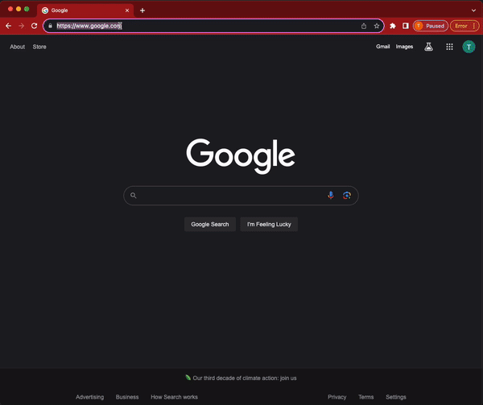

<p align="center">
  
  
</p>

---

<p align="center">
  
  
  
</p>

Aspen is a custom, keyword-based public search engine designed for a replacement for your bookmarks.

---

## Structure

|Codebase|Description|
|---|---|
|[protos](/protos)|Protobuf specs|
|[trunk](/trunk)|Rust gRPC server (authorization, db, keyword resolution)|
|[twig](/twig)|Python HTTP interface|
|[foliage](/foliage)|React web frontend|
|[catkin](/catkin)|SwiftUI iOS frontend|
---

## How it Works

Aspen uses [site search](https://support.google.com/chrome/answer/95426?hl=en&co=GENIE.Platform%3DDesktop#:~:text=Add%2C%20edit%2C%20or%20remove%20site%20search%20shortcuts) to allow you to quickly go to a page witout needing to point and click. Additionally, it doesn't rely on browser-specific customization, meaning your links will be preserved if you clear your browse cache/cookies, sign into a different account, use a different browser, or even a different computer.

## Demo



## Self Hosting

Aspen is free and avalible at https://aspn.app, but can also be self hosted. Please refer to the following `docker-compose.yml`:

```yml
version: '3.8'
services:
  trunk:
    image: "ghcr.io/erwijet/aspen/trunk:latest"
    ports:
      - 9000:9000
    environment:
      JWT_SECRET: "<your_jwt_secret>"
      MONGO_CONNECTION_STR: "<your_conection_string>"
  twig:
    image: "ghcr.io/erwijet/aspen/twig:latest"
    ports:
      - 8000:8000
```

> **please note** that if you choose to self host, you may need to update the URL targets in `twig`. They are hard-coded to point at `api.aspn.app`, but should be moved to an environment variable in a future release.

### NGINX

It is recommended to set up some sort of proxy to handle TLS. Addtionally, gRPC requires http2. Please refer to the example nginx config.

```nginx

# trunk.example.com --> your-host.example.com:9000

server {
  set $forward_scheme http;
  set $server         "your-host.example.com"; # <- change this
  set $port           9000;

  listen 80;
  listen [::]:80;

  listen 443 ssl http2;
  listen [::]:443 ssl http2;

  server_name trunk.example.com; # <-- change this

  include conf.d/include/letsencrypt-acme-challenge.conf;
  include conf.d/include/ssl-ciphers.conf;

  ssl_certificate /path/to/fullchain.pem; # <-- change this
  ssl_certificate_key /path/to/privkey.pem; # <-- and this

  proxy_set_header Upgrade $http_upgrade;
  proxy_set_header Connection $http_connection;
  proxy_http_version 1.1;

  location / {
    proxy_set_header Upgrade $http_upgrade;
    proxy_set_header Connection $http_connection;
    proxy_http_version 1.1;

    include conf.d/include/proxy.conf; # proxy
  }
}

# api.example.com --> your-host.example.com:8000

server {
  set $forward_scheme http;
  set $server         "your-host.example.com"; # <-- change this
  set $port           8000;

  listen 80;
  listen [::]:80;

  listen 443 ssl http2;
  listen [::]:443 ssl http2;

  server_name api.example.com; # <-- and this

  include conf.d/include/letsencrypt-acme-challenge.conf;
  include conf.d/include/ssl-ciphers.conf;

  ssl_certificate /path/to/fullchain.pem; # <-- also this
  ssl_certificate_key /path/to/privkey.pem; # <-- and this

  location / {
    include conf.d/include/proxy.conf; # proxy
  }
}
```